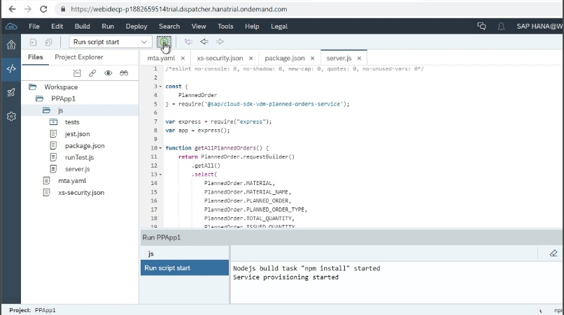

<table width=100% border=0>
<tr ><td colspan=2><h1>SAP S/4HANA Cloud</h1></td></tr>
<tr><td><h3>S/4HANA Cloud API's</h3></td><td width=66%> &nbsp;Extending S/4HANA Cloud with the Cloud SDK in Cloud Foundry/td>
</table>

## Description

This info file contains links to product downloads, help docs, etc. relevant to the S/4HANA Cloud API video series and other S/4HANA Cloud video series. Please note that this info file is subject to changes and additions.

## Extending S/4HANA Cloud with the Cloud SDK in a Cloud Foundry App
1) [Video 1 - Getting Started with the SAP API Business Hub](#v1apibh)
1) [Video 2 - Adding Custom Code to our Node JS App](#v2acc)

#### Prerequisites

* You have access to a configured S/4HANA Cloud (non-Trial) system.
* You have set up an SAP Cloud Platform (Trial or Starter) account.

#### Video 1 - Getting Started with the SAP API Business Hub

[Click here to go to the video.](https://www.youtube.com/watch?v=4zUmzzNrgVw&list=PLkzo92owKnVy3XuZSKWezGoPXTHfTT_dj)

You can access the [SAP API Business Hub here](https://api.sap.com/).

You will need to install [PostMan](https://www.getpostman.com/downloads/) to follow along with some of the testing exercises in this video series.

#### Video 2 - Adding Custom Code to our Node JS App

[Click here to go to the video.](https://www.youtube.com/watch?v=tCBRkkVucbE&list=PLkzo92owKnVy3XuZSKWezGoPXTHfTT_dj)

You can create a [SAP Cloud Platform Trial Account here](https://account.hanatrial.ondemand.com/cockpit/#/home/trialhome) if you don't already have one or if you don't have a starter or development system.

