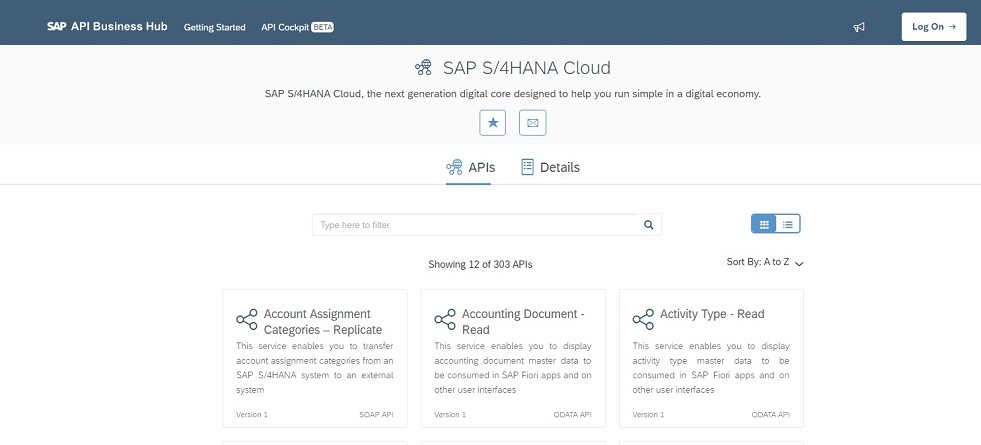

<table width=100% border=0>
<tr ><td colspan=2><h1>SAP S/4HANA Cloud</h1></td></tr>
<tr><td><h3>S/4HANA Cloud API's</h3></td><td width=66%></br>&nbsp;Discover, Explore and Consume Cloud APIs</td>
</table>


<br><br>
## NOTE: We apologize as this video series is no longer valid and the videos have been removed. Please check [the HANA Academy's YouTube channel](https://academy.saphana.com) for updated development videos.
<br><br><br><br><br>

## Description

This info file contains links to product downloads, help docs, etc. relevant to the S/4HANA Cloud API video series and other S/4HANA Cloud video series. Please note that this info file is a work in progress and subject to changes and additions.



## <a name="gss4hapi"></a>Getting Started with the S/4HANA Cloud API's
1) [Video 1 - Getting Started with the SAP API Business Hub](#v1apibh)
1) [Video 2 - Creating a Fiori App in SAP Cloud Platform](#v2cfa)
1) [Video 3 - Creating a Communication Arrangement on Your S/4HANA Cloud System](#v3cca)
1) [Video 4 - Managing your API with SAP API Management Service](#v4ams)
1) [Video 5 - Creating a Destination in SAP Cloud Platform](#v5cds)


#### Prerequisites

* You have access to a configured S/4HANA Cloud (non-Trial) system.
* You have set up an SAP Cloud Platform (Trial or Starter) account.

#### <a name="v1apibh"></a>Video 1 - Getting Started with the SAP API Business Hub

[Click here to go to the video.](https://www.youtube.com/watch?v=4zUmzzNrgVw&list=PLkzo92owKnVy3XuZSKWezGoPXTHfTT_dj)

You can access the [SAP API Business Hub here](https://api.sap.com/).

You will need to install [PostMan](https://www.getpostman.com/downloads/) to follow along with some of the testing exercises in this video series.

#### <a name="v2cfa"></a>Video 2 - Creating a Fiori App in SAP Cloud Platform

[Click here to go to the video.](https://www.youtube.com/watch?v=tCBRkkVucbE&list=PLkzo92owKnVy3XuZSKWezGoPXTHfTT_dj)

You can create a [SAP Cloud Platform Trial Account here](https://account.hanatrial.ondemand.com/cockpit/#/home/trialhome) if you don't already have one or if you don't have a starter or development system.

#### <a name="v3cca"></a>Video 3 - Creating a Communication Arrangement on Your S/4HANA Cloud System

[Click here to go to the video.](https://www.youtube.com/watch?v=mhtqPYQm98Y&list=PLkzo92owKnVy3XuZSKWezGoPXTHfTT_dj)

For online help for creating custom Business Roles in S/4HANA Cloud in the Maintain Business Role App please [do a browser search](https://www.google.com/search?q=help.sap.com%20s4hana%20cloud%20maintain%20business%20role) and click on the link to "Maintain Business Roles SAP Help Portal".

For online help on roles required for creating Communication Arrangements go to [help.sap.com](https://help.sap.com/viewer/search?q=Communication%20Arrangement%20S4HANA%20Cloud) and click on "Creating a Communication Arrangement in SAP S/4HANA Cloud".

For more info on Communication Arrangements please see [this blog](https://blogs.sap.com/2017/09/15/what-is-what-your-quick-reference-to-communication-management-and-identity-access-management-artifacts-in-s4hana/).

#### <a name="v4ams"></a>Video 4 - Managing your API with SAP API Management Service

[Click here to go to the video.](https://www.youtube.com/watch?v=8TSU-lMNf_Y&list=PLkzo92owKnVy3XuZSKWezGoPXTHfTT_dj)

In this fourth video, we will introduce the SAP Cloud Platform API Management Service for managing our API service.

#### <a name="v5cds"></a>Video 5 - Creating a Destination in SAP Cloud Platform

[Click here to go to the video.](https://www.youtube.com/watch?v=lvJHQtqDlEs&list=PLkzo92owKnVy3XuZSKWezGoPXTHfTT_dj)
 
Code for manifest.json file. To be added below the "resources": "resources.json" line.

```
"dataSources": {
	"mainService": {
		"uri": "/s4hanacloud/sap/opu/odata/sap/API_PLANNED_ORDERS",
		"type": "OData",
		"settings": {
			"odataVersion": "2.0",
			"localUri": "localService/metadata.xml"
		}
	}
},
```


#### Additional Information

This video series is based on the work by Divya Mary at the following blogs.

&nbsp;&nbsp;&nbsp;&nbsp;&nbsp;&nbsp;&nbsp;&nbsp;[Part 1: Discover, Explore and Consume SAP S/4HANA Cloud APIs in SAP API Business Hub](https://blogs.sap.com/2017/12/05/part-1-discover-explore-and-consume-sap-s4-hana-cloud-apis-in-sap-api-business-hub/)

&nbsp;&nbsp;&nbsp;&nbsp;&nbsp;&nbsp;&nbsp;&nbsp;[Part 2: Discover, Explore and Consume SAP S/4HANA Cloud APIs in SAP API Business Hub](https://blogs.sap.com/2017/12/05/part-2-discover-explore-and-consume-s4-hana-cloud-apis-in-sap-api-business-hub/)

&nbsp;&nbsp;&nbsp;&nbsp;&nbsp;&nbsp;&nbsp;&nbsp;[Part 3: Discover, Explore and Manage SAP S/4HANA Cloud APIs in SAP Cloud Platform API Management](https://blogs.sap.com/2017/12/11/part-3-discover-explore-and-consume-s4-hana-cloud-apis-in-sap-cloud-platform-api-management/)

&nbsp;&nbsp;&nbsp;&nbsp;&nbsp;&nbsp;&nbsp;&nbsp;[Part 4: Discover, Explore and Manage SAP S/4 HANA Cloud APIs in SAP Cloud Platform API Management](https://blogs.sap.com/2017/12/11/part-4-discover-explore-and-manage-s4-hana-cloud-apis-in-sap-cloud-platform-api-management/)

&nbsp;&nbsp;&nbsp;&nbsp;&nbsp;&nbsp;&nbsp;&nbsp;[Part 5: Discover, Explore and Manage SAP S/4 HANA Cloud APIs in SAP Cloud Platform API Management](https://blogs.sap.com/2017/12/11/part-5-discover-explore-and-manage-sap-s4-hana-cloud-apis-in-sap-cloud-platform-api-management/)


